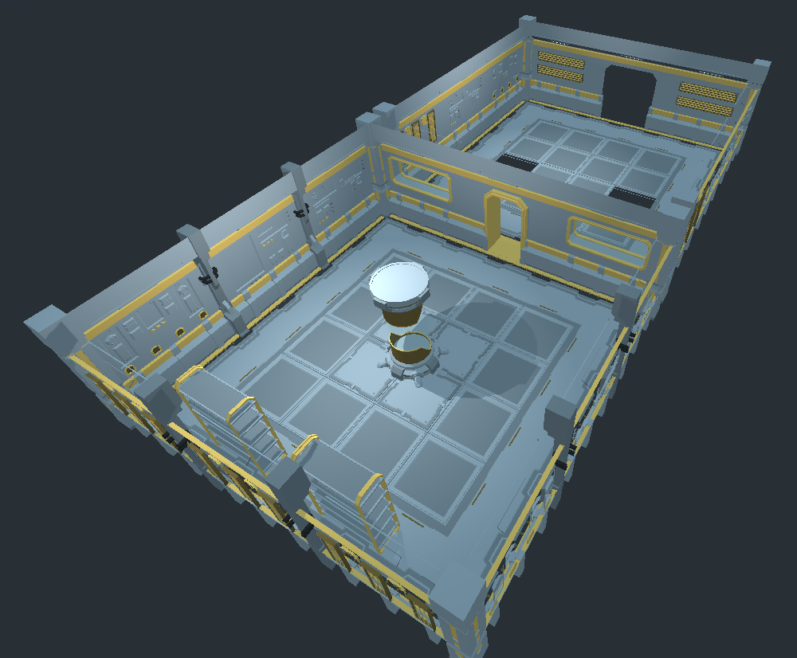

# Quaternius-Modular-Scifi-Pack
This repository contains the [Quaternius Ultimate Modular Scifi Pack](https://quaternius.com/packs/ultimatemodularscifi.html)
converted to a Godot asset. If you like the asset, consider supporting them on [Patreon](https://www.patreon.com/quaternius).

# Usage
The assets are provided as both nodes and as a mesh library for use with GridMap nodes.

The mesh library is easier for constructing levels, however grid maps don't support
occlusion culling.

The nodes contain occlusion culling polygons, however it takes significantly longer
to construct levels.

## Grid Map Configuration
In order to position the mesh library elements correctly; the grid map should be configured
for:
 - Cell Size [1, 1, 1]
 - Center X=Off, Y=Off, Z=Off

